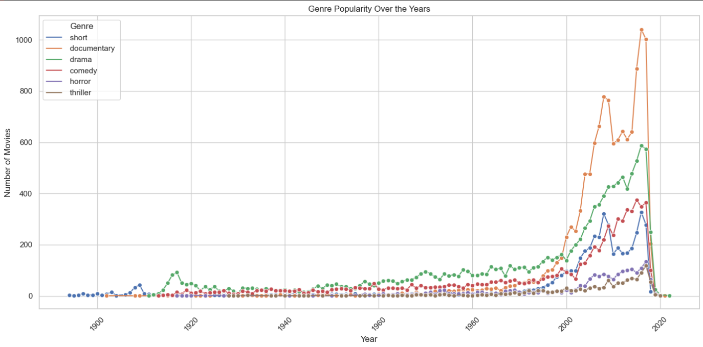

# CodSoft Machine Learning Virtual Internship 🚀

This repository contains my projects completed during the **CodSoft ML Virtual Internship**.  
The projects cover a variety of domains including customer churn, fraud detection, and movie genre classification (both traditional ML and NLP-based approaches).

---

## 📂 Projects

### 1. Customer Churn Prediction (XGBoost Classifier)
- **Model:** `XGBClassifier`
- **Accuracy:** `0.8695`
- **Results:**
  - **Confusion Matrix:**  
    ```
    [[1521   86]
     [ 175  218]]
    ```
  - **Classification Report:**
    | Class | Precision | Recall | F1-Score | Support |
    |-------|-----------|--------|----------|---------|
    | 0     | 0.90      | 0.95   | 0.92     | 1607    |
    | 1     | 0.72      | 0.55   | 0.63     | 393     |

- **Visualizations:**
  - 

---

### 2. Fraud Detection (Random Forest Classifier)
- **Model:** `RandomForestClassifier`
- **Results:**
  - **Classification Report:**
    | Class | Precision | Recall | F1-Score | Support |
    |-------|-----------|--------|----------|---------|
    | 0     | 1.00      | 0.99   | 0.99     | 257,811 |
    | 1     | 0.28      | 0.88   | 0.42     | 1,524   |

  - **Accuracy:** `0.99`

- **Visualizations:**
  - 

---

### 3. Movie Genre Classification (Logistic Regression)
- **Model:** `Logistic Regression`
- **Best Params:** `{'C': 1, 'penalty': 'l2', 'solver': 'lbfgs'}`
- **Cross-Validation Accuracy:** `0.5718`
- **Test Accuracy:** `0.5825`

- **Visualizations:**
  - 
  - 

---

### 4. Movie Genre Classification using NLP (DistilBERT)
- **Model:** `distilbert-base-uncased`
- **Test Accuracy:** `0.6264`
- **Classification Report (excerpt):**
  | Class | Precision | Recall | F1-Score |
  |-------|-----------|--------|----------|
  | 0     | 0.55      | 0.34   | 0.42     |
  | 1     | 0.58      | 0.50   | 0.54     |
  | 7     | 0.76      | 0.85   | 0.81     |
  | 8     | 0.62      | 0.71   | 0.66     |
  | 26    | 0.87      | 0.88   | 0.88     |

- **Visualizations:**
  - 

---

## 🖼️ Visualizations Overview
- **Customer Churn Prediction:** Top 10 Important Features  
- **Fraud Detection:** Confusion Matrix  
- **Movie Genre Classification (Logistic Regression):** Genre Popularity Over the Years, Genre Distribution  
- **Movie Genre Classification (NLP - DistilBERT):** Top 20 Most Frequent Words  

---

## ⚡ Tech Stack
- **Languages:** Python
- **Libraries/Frameworks:** Scikit-learn, XGBoost, RandomForest, Logistic Regression, Transformers (Hugging Face), NLP
- **Tools:** Jupyter Notebook, Pandas, Matplotlib, Seaborn

---

## 📌 Internship
This work was completed as part of the **CodSoft Machine Learning Virtual Internship**, showcasing end-to-end ML workflows including:
- Data preprocessing  
- Model training & evaluation  
- Hyperparameter tuning  
- Visualization & interpretability  

---
